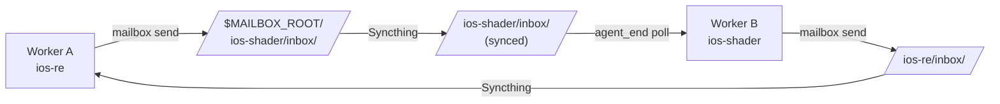
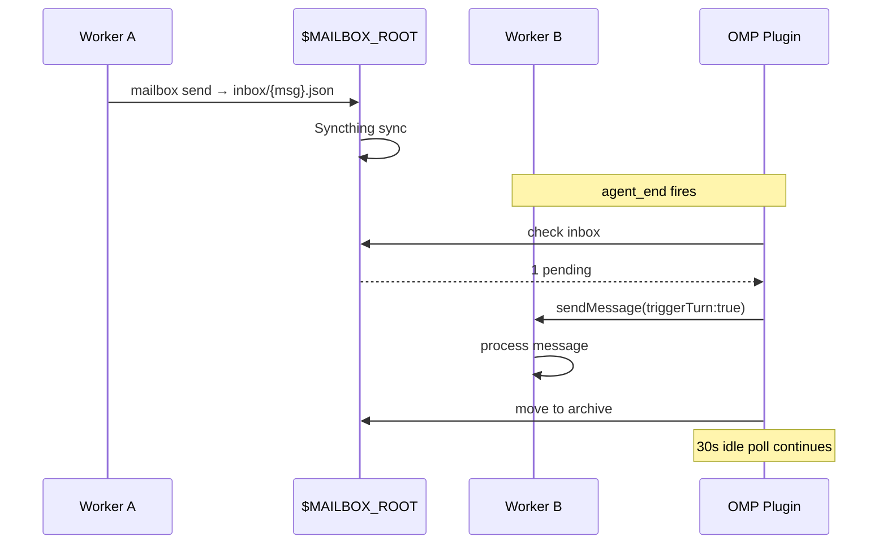
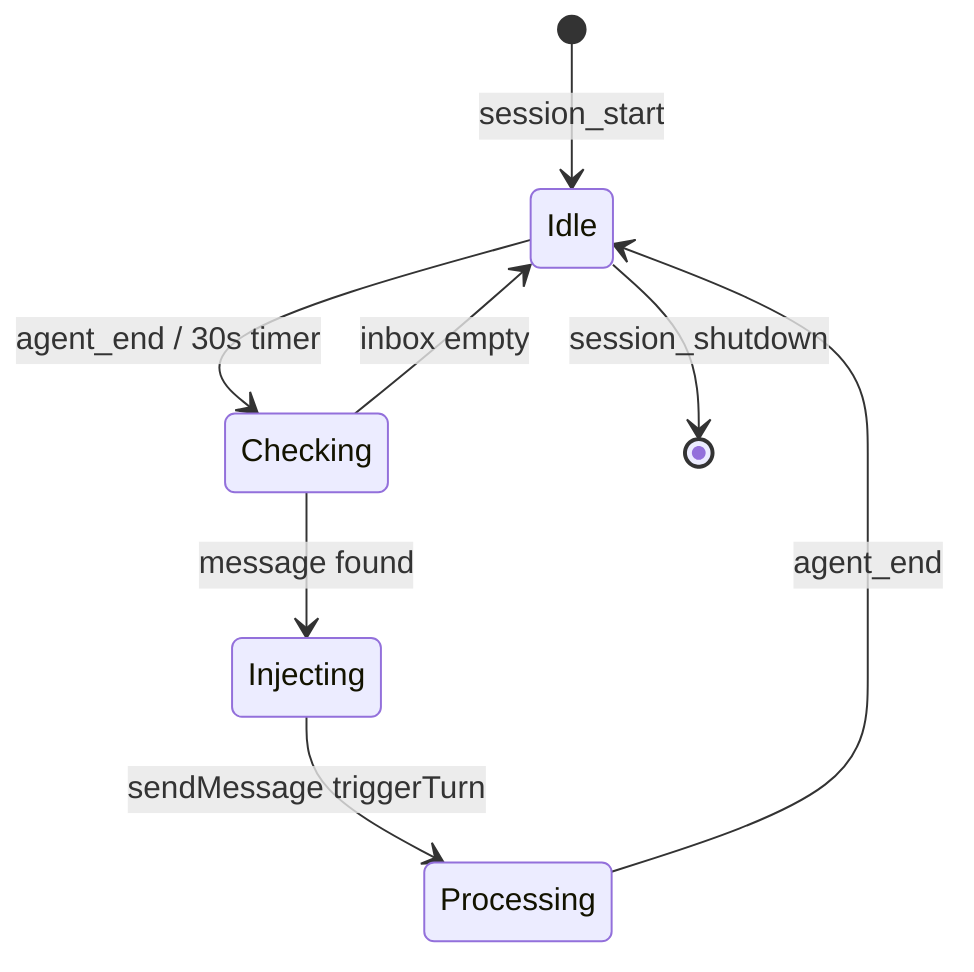

# omp-mailbox-plugin

OMP extension for Syncthing-native direct-inbox worker-to-worker messaging.

> **No relay daemon. No Manager intervention.** Workers communicate directly through a shared filesystem, synced by Syncthing across machines.

## Architecture



## Usage Scenarios

### 1. Cross-Platform Reverse Engineering

Two workers collaborate on iOS shader analysis:

```bash
# ios-re sends findings to ios-shader
mailbox send --from ios-re --to ios-shader \
  --subject "Glass shader: 9 sub-functions mapped" \
  --body "Passes: vibrant_light @L7702, sdf_rim @L9660, ..."

# ios-shader auto-receives via OMP plugin, sends results back
mailbox send --from ios-shader --to ios-re \
  --subject "Test PSNR after vibrant_light fix" \
  --body "PSNR improved from 11.2 to 48.9 dB"
```

### 2. Manager Task Dispatch

```bash
# Manager dispatches task to aosp worker
mailbox send --from manager --to aosp \
  --kind TASK --subject "Analyze RenderEngine pipeline" \
  --body "Decompile SkiaGLRenderEngine::drawLayers @..."
```

### 3. Multi-Worker Status Monitoring

```bash
# Any worker can check peer status
mailbox stats --worker ios-re     # inbox: 0, archive: 3
cat $MAILBOX_ROOT/ios-re/status.json
# {"state":"IDLE","current_task":"...","last_conclusion":"..."}
```

## Notification Flow



## Lifecycle



## Features

- **Zero relay** — Syncthing handles cross-machine delivery
- **Auto-notification** — `agent_end` + 30s `ctx.setInterval` idle polling
- **Wake on message** — `triggerTurn: true` starts new OMP turn
- **Type-safe** — Full `ExtensionAPI` types (no `any`)
- **Standalone CLI** — `tools/mailbox` works without OMP
- **Read-after-validate** — corrupt messages → `_corrupt/`, never silently dropped

## Installation

```bash
omp install git:github.com/comicchang/omp-mailbox-plugin
```

## Configuration

| Env | Required | Description |
|---|---|---|
| `OMP_WORKER_ID` | Yes | Worker ID matching inbox directory |
| `MAILBOX_ROOT` | No | Path to shared mailbox root |

## Directory Layout

```
$MAILBOX_ROOT/
  {worker_id}/
    inbox/          ← Others write here (Syncthing)
    archive/        ← Read messages (cleared at task end)
    _corrupt/       ← Unparseable messages
    processing/     ← In-flight claim lock
    status.json     ← Self-reported state
```

## License

MIT
